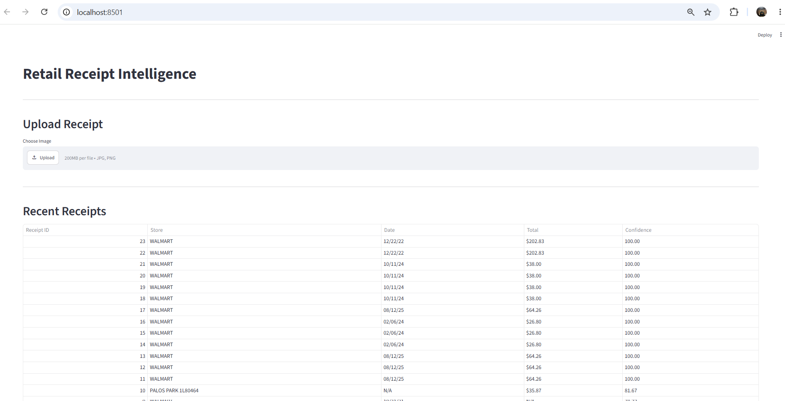
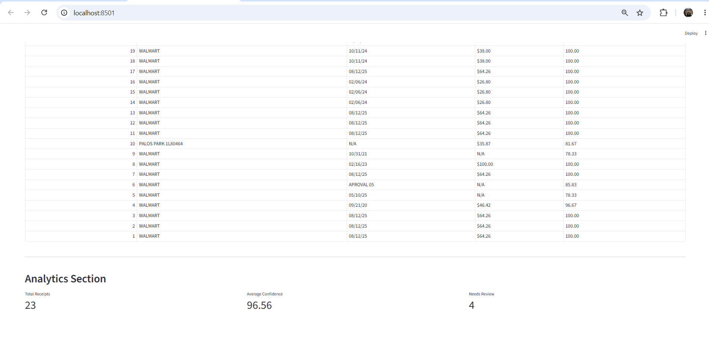
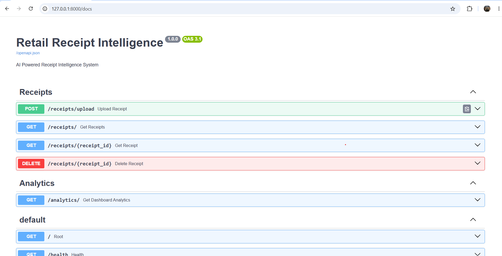
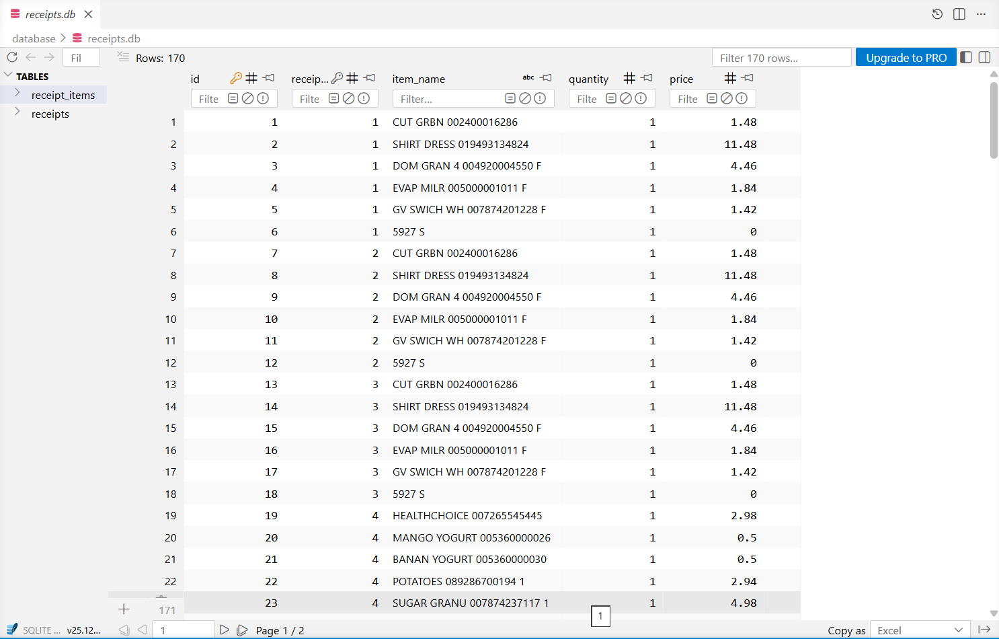
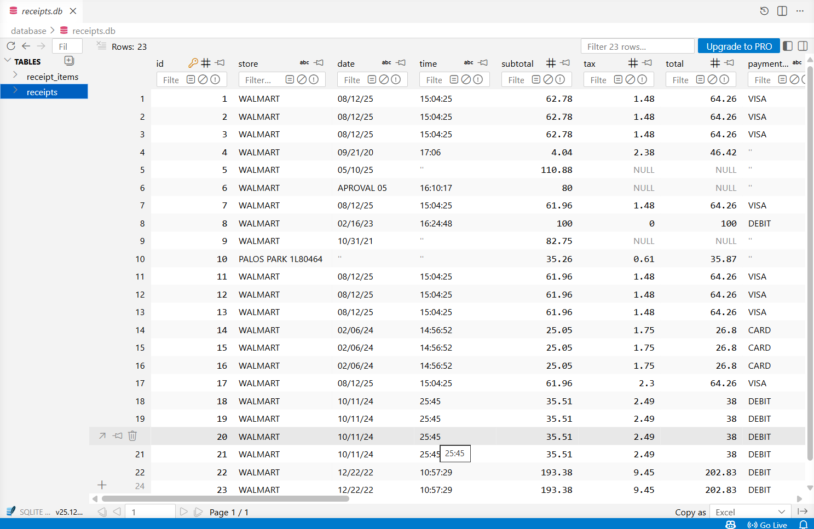

# 🧾 Retail Receipt Intelligence

<p align="center">


</p>

> **An end-to-end AI-powered receipt processing system that automatically detects receipts, extracts text, parses structured information, stores results in SQLite, and visualizes everything through a FastAPI backend and Streamlit dashboard.**

---

# 📌 Project Overview

Retail Receipt Intelligence automates receipt digitization using Computer Vision and OCR.

The application performs:

- 📷 Receipt Detection using **YOLO11s**
- ✂️ Automatic Receipt Cropping
- 🔍 OCR using **EasyOCR**
- 🧾 Receipt Parsing
- 📊 Confidence Score Calculation
- 💾 SQLite Database Storage
- ⚡ FastAPI REST APIs
- 📈 Streamlit Dashboard

---

# 🚀 Demo

## Streamlit Dashboard



---

## Analytics Dashboard



---

## FastAPI Swagger Documentation



---

## SQLite Database

### Receipts Table



### Receipt Items Table



---

# 🏗 System Architecture


The application follows a modular service-oriented architecture.

```
Upload Receipt
      │
      ▼
YOLO11s Detection
      │
      ▼
Receipt Cropping
      │
      ▼
EasyOCR
      │
      ▼
Receipt Parser
      │
      ▼
Confidence Scoring
      │
      ▼
SQLite Database
      │
      ▼
FastAPI API
      │
      ▼
Streamlit Dashboard
```

A detailed explanation is available in **ARCHITECTURE.md**.

---

# ✨ Features

✅ Receipt Detection using YOLO11s

✅ Automatic Receipt Cropping

✅ OCR using EasyOCR

✅ Extracts

- Store Name
- Date
- Time
- Purchased Items
- Quantity
- Tax
- Subtotal
- Total
- Payment Method

✅ Confidence Score Generation

✅ JSON Export

✅ SQLite Database Storage

✅ REST API using FastAPI

✅ Interactive Streamlit Dashboard

---

# 🛠 Technology Stack

| Category | Technology |
|-----------|------------|
| Language | Python 3.12 |
| Object Detection | YOLO11s |
| OCR | EasyOCR |
| Backend | FastAPI |
| Dashboard | Streamlit |
| ORM | SQLAlchemy |
| Database | SQLite |
| Deep Learning | PyTorch |
| Image Processing | OpenCV |

---

# 📂 Project Structure

```
Retail-Receipt-Intelligence
│
├── api/
│   ├── routes/
│   ├── services/
│   ├── database/
│   └── schemas.py
│
├── dashboard/
│   ├── app.py
│   └── streamlit_app.py
│
├── database/
│
├── dataset/
│   ├── README.md
│   └── originals/
│       └── 44.jpg
│
├── models/
│
├── ocr/
│
├── parser/
│
├── screenshots/
│
├── uploads/
│
├── outputs/
│
├── utils/
│
├── ARCHITECTURE.md
├── QUICKSTART.md
├── requirements.txt
└── README.md
```

---

# ⚙️ Installation

Clone the repository

```bash
git clone https://github.com/mailtoshikharchauhan-lab/Retail-Receipt-Intelligence.git
```

Go inside the project

```bash
cd Retail-Receipt-Intelligence
```

Create a virtual environment

```bash
python -m venv venv
```

Activate it

Windows

```bash
venv\Scripts\activate
```

Install dependencies

```bash
pip install -r requirements.txt
```

---

# ▶️ Running the Backend

Start FastAPI

```bash
uvicorn api.main:app --reload
```

Open

```
http://127.0.0.1:8000/docs
```

---

# ▶️ Running the Dashboard

```bash
streamlit run dashboard/streamlit_app.py
```

Open

```
http://localhost:8501
```

---

# 📡 REST API Endpoints

| Method | Endpoint | Description |
|---------|----------|-------------|
| POST | `/receipts/upload` | Upload & Process Receipt |
| GET | `/receipts` | Retrieve All Receipts |
| GET | `/receipts/{id}` | Retrieve Single Receipt |
| DELETE | `/receipts/{id}` | Delete Receipt |
| GET | `/analytics` | Dashboard Analytics |

---

# 🧪 Sample Image

For demonstration purposes, one sample receipt image is included.

```
dataset/originals/44.jpg
```

Upload this image using:

- Streamlit Dashboard
- Swagger UI

---

# 📊 Output

For every uploaded receipt, the system generates:

- Cropped Receipt Image
- Parsed JSON
- Database Record
- Confidence Score
- Structured Receipt Fields
- Dashboard Visualization

---

# 📈 Future Improvements

- PaddleOCR integration for higher OCR accuracy
- Multi-language receipt support
- Bulk receipt processing
- Receipt editing workflow
- Docker deployment
- Cloud deployment
- User authentication
- Export to Excel/PDF

---

# 📖 Documentation

Additional documentation included:

- **ARCHITECTURE.md**
- **QUICKSTART.md**

---

# 👨‍💻 Author

## Shikhar Chauhan

**Master of Computer Applications (MCA)**

Interested in:

- Computer Vision
- Artificial Intelligence
- Deep Learning
- Backend Development
- FastAPI
- Python

### GitHub

https://github.com/mailtoshikharchauhan-lab

### LinkedIn

https://www.linkedin.com/in/shikharchauhanurl/

---

# ⭐ If you found this project useful, consider giving it a Star!

---

# 📄 License

This project is licensed under the MIT License.
